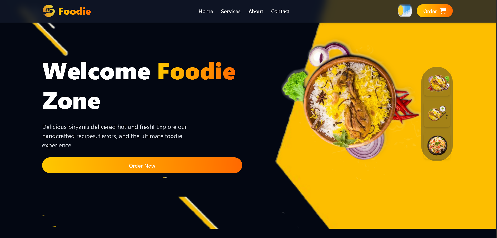
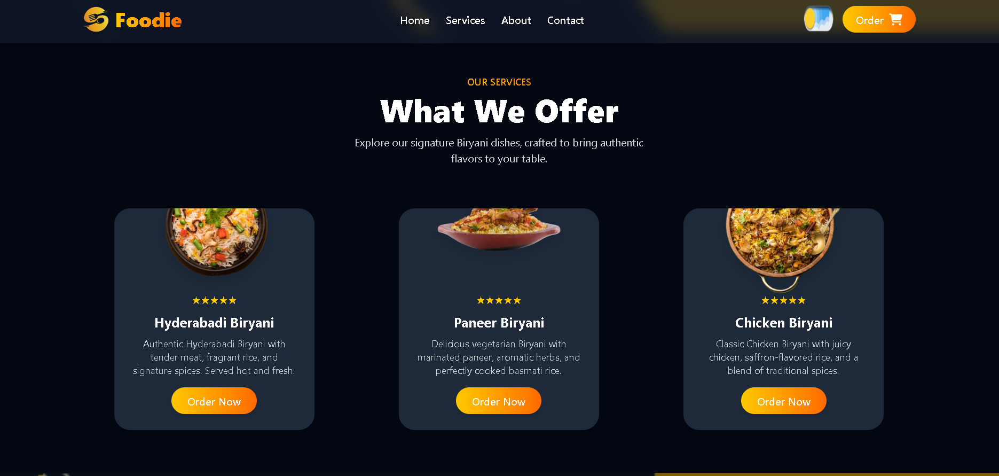
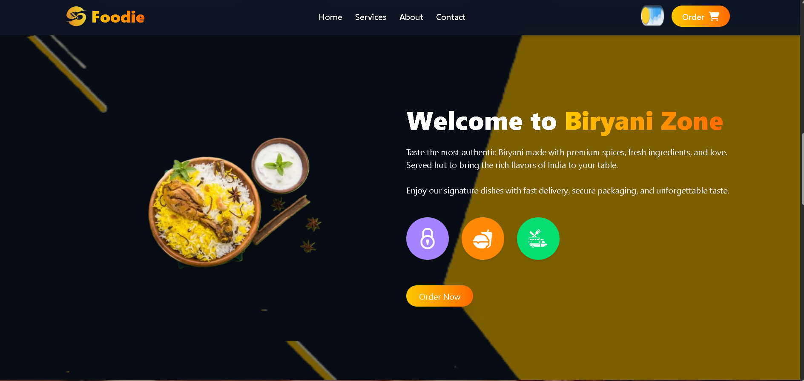
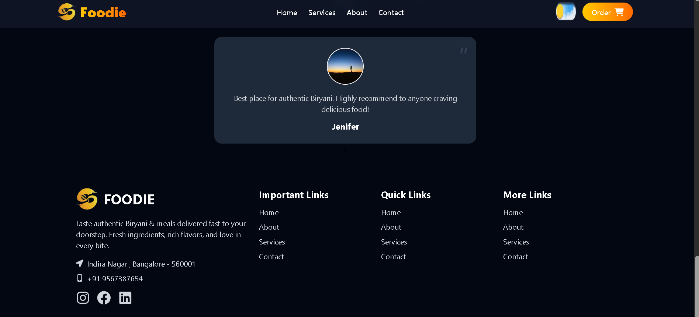

# 🍛 Food-Nest — Food Delivery Web App

A bold, responsive food delivery web app built with React and Tailwind CSS.
Browse signature Biryani dishes, explore the menu, and place orders — all in a fast, modern UI.

---

## Screenshots

| Hero | Biryani Zone |
|------|-------------|
|  |  |

| What We Offer | Reviews & Footer |
|--------------|-----------------|
|  |  |

---

## Features

- 🏠 Stunning hero section with split-screen design
- 🍽️ Menu cards — Hyderabadi, Paneer & Chicken Biryani with ratings
- ⭐ Customer testimonials section
- 📱 Fully responsive across all screen sizes
- 🛒 Order Now CTA across multiple sections
- 🔗 Multi-page navigation — Home, Services, About, Contact
- 🦶 Detailed footer with social links and contact info

## Tech Stack

| Layer | Tech |
|-------|------|
| Frontend | React, Vite |
| Styling | Tailwind CSS |
| Language | JavaScript |

## Getting Started

```bash
git clone https://github.com/Esthercodes643/Food-Nest.git
cd Food-Nest
npm install
npm run dev
```

---
✨
